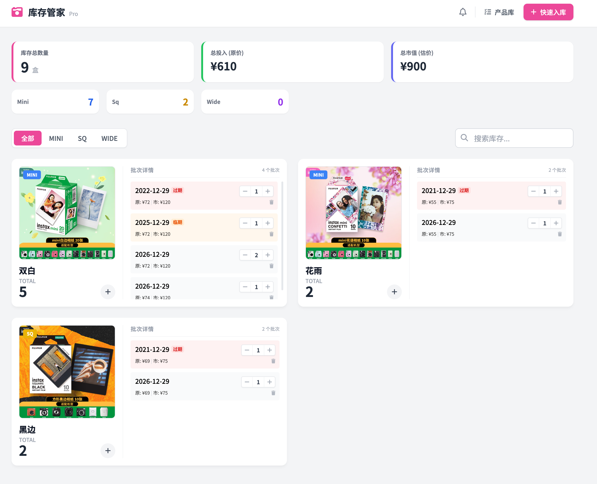

# **📸 Fujifilm Instant Film Inventory Manager (拍立得库存管家)**

一个基于 Web 的拍立得相纸库存管理系统。支持多规格管理、库存预警、价格追踪以及 Bark 通知推送。

## **✨ 主要功能**

* **📦 库存管理**：直观的卡片式布局，支持 Mini / Square / Wide 三种规格。  
* **🏭 产品库 (Master Data)**：一次录入，多次复用。支持预设原价与市场价。  
* **💰 资产统计**：自动计算库存总原价投入与当前市场总估值。  
* **📅 智能批次**：同一种相纸支持管理不同过期时间的批次。  
* **⏳ 过期预警**：  
  * 🔴 已过期  
  * 🟠 临期 (3个月内)  
  * 🟡 预警 (6个月内)  
* **📱 Bark 通知**：一键扫描库存，将过期和临期信息推送到你的手机 (iOS)。  
* **🐳 Docker 部署**：极简部署，数据持久化存储。

## **📸 预览**

## **🚀 快速开始 (Docker)**

这是最推荐的运行方式。

### **前置要求**

* 安装 [Docker](https://www.docker.com/) 和 Docker Compose。

### **运行步骤**

1. 克隆仓库：  
   https://github.com/dbdb5269/fujifilm-inventory.git
   cd fujifilm-inventory

2. 启动服务：  
   docker-compose up -d

3. 访问应用：  
   打开浏览器访问 http://localhost:8081

### **数据持久化**

所有数据（SQLite 数据库）将保存在项目根目录下的 data/ 文件夹中。请务必备份该文件夹。

## **🛠️ 本地开发 (非 Docker)**

如果你想修改代码：

1. 安装依赖：  
   pip install -r requirements.txt

2. 运行后端：  
   python app.py

3. 访问 http://localhost:5000

## **📁 项目结构**

* app.py: Flask 后端与 API 逻辑。  
* polaroid\_inventory\_api.html: Vue3 单文件前端。  
* schema.sql: 数据库初始化脚本。  
* data/: 存放 SQLite 数据库文件的目录 (Docker 挂载)。

## **📝 License**

本项目采用 [Apache License 2.0](https://www.google.com/search?q=LICENSE) 开源。